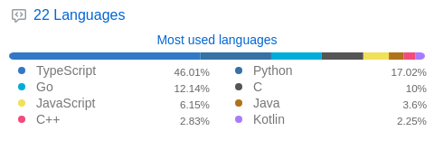
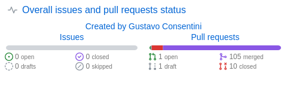

  

  
  
  
  
  
  
  
  
  
  
  
  
  
  
  
  
  
  

## Tech stack

**Backend**
Kotlin · Spring Boot · Ruby on Rails · Java · Python

**APIs**
gRPC / Protobuf · GraphQL · OpenAPI · REST

**Data & Messaging**
PostgreSQL · Redis · RabbitMQ

**Infrastructure**
AWS (CDK, Step Functions, Lambda) · Kubernetes · Docker · ArgoCD

**Frontend**
TypeScript · React · Node.js · Tailwind · Storybook

**Testing**
JUnit 5 · Cucumber (BDD) · Playwright

  
  
  
  

## Languages

  

  

## Get in touch

